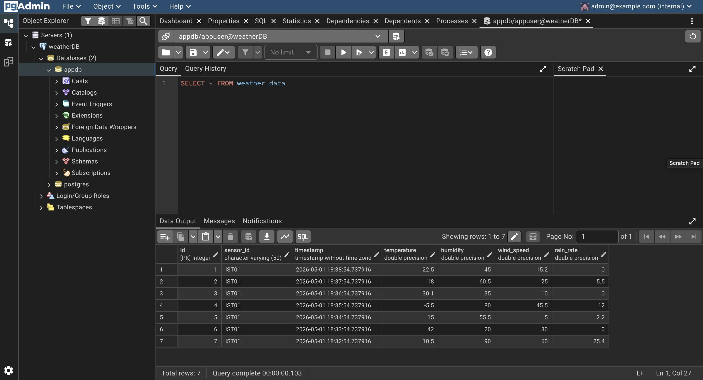
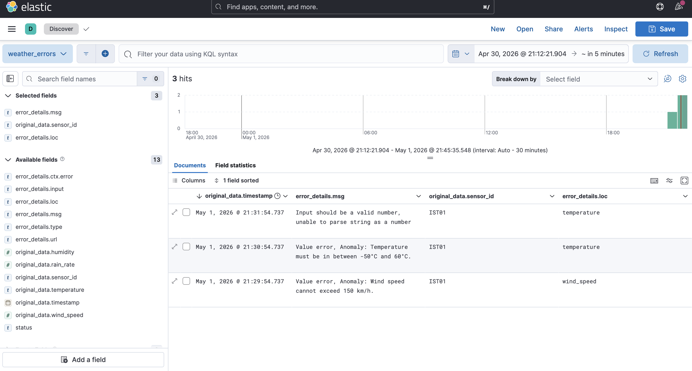

# Weather Data Pipeline with Validation & Monitoring

## 1. What is this tool?

This project demonstrates an end-to-end data pipeline that simulates a weather sensor API and processes incoming data through validation, storage, and monitoring layers.
The pipeline uses Apache NiFi for orchestration, Pydantic for schema validation, PostgreSQL for structured storage, and Elasticsearch + Kibana for error logging and visualization.

---

## 2. Prerequisites

Before running the project, ensure the following requirements are met:

### Operating System

* Linux / macOS / Windows (with WSL recommended for Windows)

### Required Software

* **Docker** ≥ 24.x
* **Docker Compose** ≥ v2.x

### Python Dependencies (inside containers)

From `requirements.txt`:

```
fastapi==0.109.0
uvicorn==0.27.0
pydantic==2.6.0
psycopg2-binary==2.9.9
elasticsearch==8.11.0
```

---

## 3. Installation

Clone the repository:

```bash
git clone https://github.com/Alimk2357/weather-sensor-pipeline.git
```

No manual dependency installation is required since everything runs via Docker.

---

## 4. Running the Example (Demo Guide)

Start all services using Docker:

```bash
docker-compose up --build -d
```

This command builds images automatically and starts all containers, including the API.

After the system is up, follow the steps below to configure the pipeline and observe the data flow.

---

### A. Apache NiFi Configuration (Setting Up Data Flow)

NiFi will fetch data from the API and execute the Pydantic validation script.

#### 1. Access NiFi UI:

* Open: `https://localhost:8443/nifi`
* Accept the security warning if prompted.

**Credentials:**

* Username: `nifi`
* Password: `NifiNifi_12345!`

---

#### 2. Fetch Data from API (InvokeHTTP Processor):

* Drag a **Processor** onto the canvas.
* Search for `InvokeHTTP` and add it.
* Right-click → **Configure** → **Properties**

Set:

* `HTTP Method`: `GET`
* `Remote URL`: `http://sensor-api:8000/weather/IST01`

Click **Apply**.

---

#### 3. Run Pydantic Script (ExecuteStreamCommand Processor):

* Add another Processor → search `ExecuteStreamCommand`
* Right-click → **Configure** → **Properties**

Set:

* `Command Path`: `python3`
* `Command Arguments`: `/opt/nifi/nifi-current/pydantic_scripts/validator.py`
* `Ignore STDIN`: `false`

Click **Apply**.

---

### 4. Connections and Terminate Settings

#### A. Connect InvokeHTTP → ExecuteStreamCommand

* Drag connection from `InvokeHTTP` to `ExecuteStreamCommand`
* In **Create Connection**, select only:

  * `Response`
* Click **Add**

---

#### B. Terminate Settings for InvokeHTTP

* Right-click → **Configure** → **Relationships**

Enable **terminate** for:

* `Original`
* `Failure`
* `Retry`
* `No Retry`

Then go to **Scheduling**:

* Change `Run Schedule` from `0 sec` to `24 hours`.

Click **Apply**

---

#### C. Terminate Settings for ExecuteStreamCommand

* Right-click → **Configure** → **Relationships**

Enable **terminate** for:

* `nonzero status`
* `original`
* `output stream`

Click **Apply**

[!WARNING] If both processors show a red **Stopped** icon, configuration is correct.
Right-click → **Start** to begin the data flow.

---

### B. Observing and Validating Results (Expected Output)

#### 1. PostgreSQL Validation via pgAdmin

1. Open: `http://localhost:5050`
   Login:

   * Email: `admin@example.com`
   * Password: `admin`

2. Register server:

   * Host: `postgres-db`
   * Port: `5432`
   * User: `appuser`
   * Password: `apppass`

3. Navigate:

   ```
   Databases → appdb → Query Tool
   ```

4. Run:

```sql
SELECT * FROM weather_data;
```

**Expected Output:**
Out of 10 generated records, exactly **7 valid rows** should be stored.

---

#### 2. Error Logs via Kibana

Invalid data (e.g., wind speed > 150 km/h) is logged into Elasticsearch.

1. Open: `http://localhost:5601`
2. Go to **Discover**
3. Click **Create Data View**

Set:

* Index pattern: `pydantic-errors*`
* Timestamp field: `original_data.timestamp`

Click **Save**

---

#### Customize Table View:

Add fields:

* `error_details.msg`
* `original_data.sensor_id`
* `error_details.loc`

---

**Expected Output:**
You should see **3 invalid records** with clear validation errors such as:

* *Input should be a valid number, unable to parse string as a number*
* *Anomaly: Temperature must be in between -50°C and 60°C.*
* *Anomaly: Wind speed cannot exceed 150 km/h.*

---

## 5. Expected Output

### Summary:

* Total API records: **10**
* Valid records in PostgreSQL: **7**
* Invalid records in Elasticsearch: **3**

### Sample SQL Output:



### Sample Kibana Output:



## 6. AI Usage Disclosure

* **ChatGPT:** Construction of README and some of slide photos
* **Gemini:** Coding assistance
* **NotebookLM:** Summary of lecture notes
